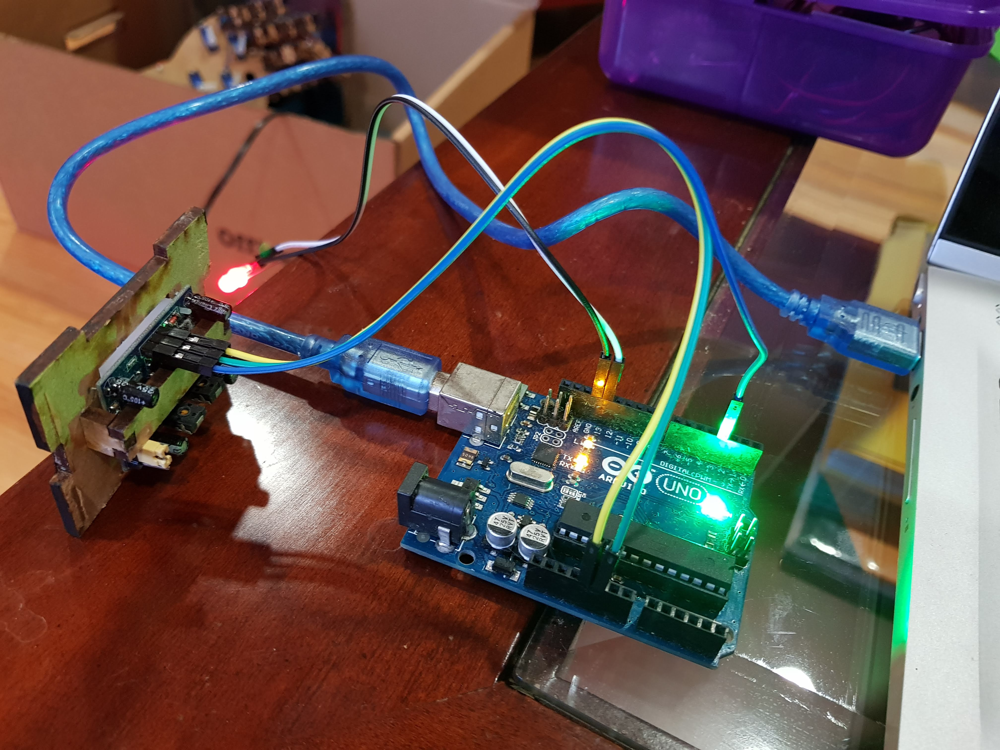
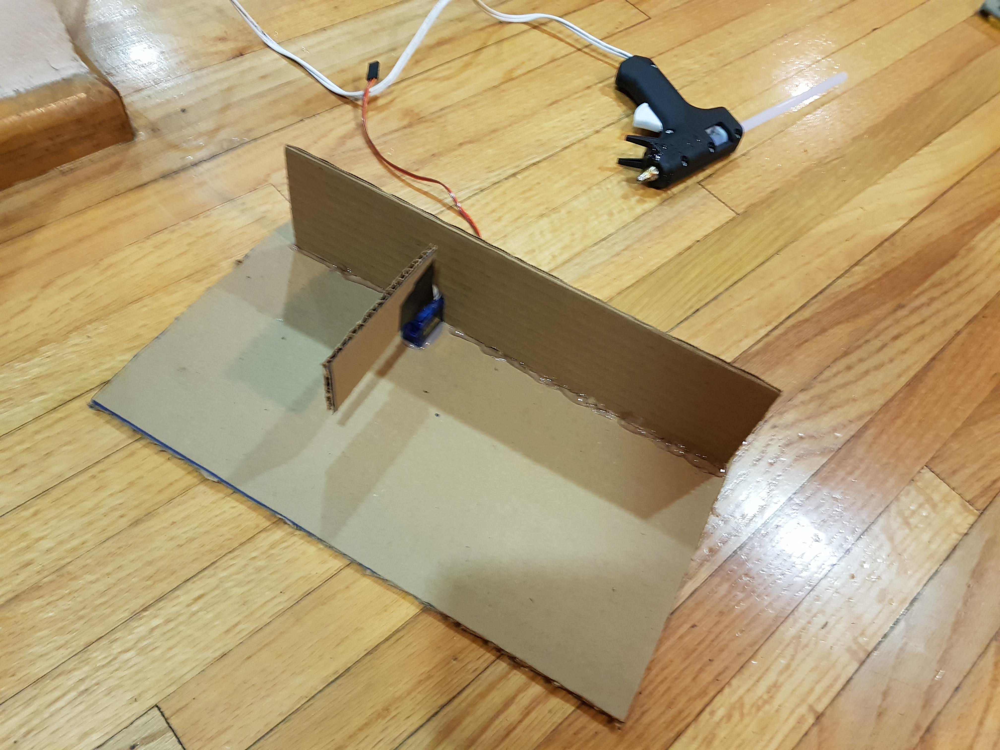

# Arduino Smart Bin - Visual Documentation

This folder contains visual resources documenting the Arduino Smart Bin project phases and assembly.

## Project Phases

### Phase 1: PIR Motion Sensor Testing
Basic motion detection setup using a Passive Infrared (PIR) sensor with LED feedback.

### Phase 2: Servo Motor Control Testing  
Servo motor integration and control on pin 8 with rotation between 0 and 180 degrees.

### Phase 3: Motion-Triggered Actuator Control
Combines PIR sensor input with actuator control on pins 9 and 12 based on motion events.

### Phase 4: RGB LED Status with Servo Integration
Complete system with RGB LED status indicators and servo actuation responding to motion detection.

---

## Visual References

### 1. Hardware Connection Diagram


Shows the basic wiring diagram for connecting the PIR motion sensor and LED indicators to the Arduino board. Demonstrates pin assignments and power connections.

### 2. Servo Door Assembly


Displays the physical assembly of the servo motor mechanism configured as a door/lid actuator for the smart bin. Shows mechanical integration and servo positioning.

### 3. System Operation Animation


Animated demonstration of the complete Phase 4 system in operation. Shows:
- Motion detection triggering the system
- RGB LED color transitions (blue → green → red)
- Servo motor actuation in response to motion
- Timing sequence and state transitions

### 4. Final Build


Complete assembled Arduino Smart Bin in operation. Shows the final integration of all components working together in a functional unit with RGB status feedback and servo-controlled lid mechanism.

---

## Project Structure

```
arduino-smart-bin/
├── src/
│   └── sketch.ino       (Combined phases 1-4 implementation)
├── assets/              (Visual documentation)
│   ├── README.md        (This file)
│   ├── 1_PIR_LED_CONNECTION.jpg
│   ├── 2_SERVO_DOOR_Assemble.jpg
│   ├── 3_PIR_LED_SERVO_function.gif
│   └── 4_final_build.gif
└── README.md           (Main project documentation)
```

---

**Date:** May 02, 2019  
**Author:** Arturo Vargas Cuevas  
**Course:** Liderazgo Emprendedor - Tecnológico de Monterrey
